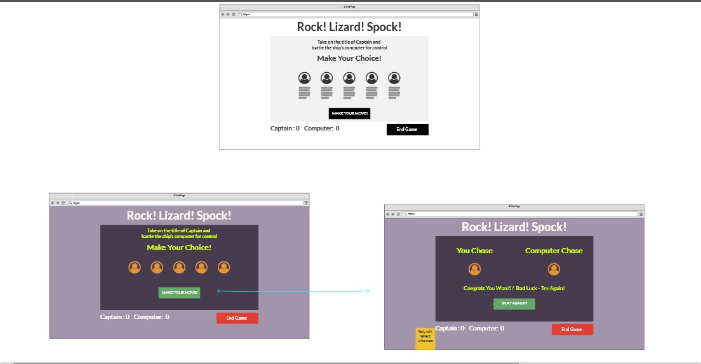

# <em>'Rock! Lizard! Spock!'</em>

'Rock! Lizard! Spock!' is an interactive front-end site that responses to the user's choice of game token against an automated generated token. The site's aim is to provide the user with a portal of entertainment as they partake in a game of chance, while documenting within the game the user's success tally and options to continue or quit the game.

THE LIVE SITE can be accessed through this [link](https://mjmcp.github.io/rock-lizard-spock/)

# Contents
- [User Experience UX](#user-experience-ux)
  - [External User Goals](#external-user-goals)
  - [Site Owner's Goals](#site-owners-goals)
  - [Wireframes](#wireframes)
  - [Design Choices](#design-choices)
    - [Typography](#typography)
    - [Colour Scheme](#colour-scheme)
- [Features](#features)
  - [Overall Page]()
    - [Game Play area](#navigation-r)
    - [Icons](#icons)
    - [Buttons](#buttons)
- [Future Features to Implement](#future-features-to-implement)
- [Technologies Used](#technologies-used)
- [Testing](#testing)
    - [Validator Testing](#validator-testing)
    - [Unfixed Bugs](#unfixed-bugs)
- [Deployment](#deployment)
- [Cloning](#cloning)
- [Credits](#credits)
  - [Content](#content)
  - [Media](#media)
- [Acknowledgements](#acknowledgements)

# User Experience UX
The user demographic is anyone with access to an internet accessible device from age 6 years and up. By this age, the user will have the literary and critical thinking skills to follow the instructions and complete the tasks in order to complete the game.

[Back to Contents](#contents)

## External User Goals  
- As a user, I want to access the game all on one page.
- As a user, I want to understand the instructions as they is presented to me.
- As a user, I want to clearly make out the icons and buttons to enable play.
- As a user, I want to clearly see the outcome of my game performance.
- As a user, I want to exit the game early should I wish to.

## Site Owner's Goals
- As the owner, I want to provide an entertaining game that can be played by the user through their preferred device.
- As the owner, I want the user to play the game for a limited number of tries before offering them the opportunity of another round.
- As the owner, I want to provide a score tracking function that will stay increment wins and losses until the player reaches a best-out-of-5 tally.

[Back to Contents](#contents)

## Wireframes
These are the basic layouts for the game in both desktop and mobile. I expected the tablet version of the game to borrow closely from the size closest to it due to the fact that the game is playable through most browsers.

## Design Choices
  
### Typography
The fonts chosen for this project were <em>Merriweather Sans</em> for the headings (h1, h2 etc), <em>Cabin</em> for the body text and a third text of <em>Quattrocento Sans</em> for the button text.

Merriweather Sans is described on the Google fonts site as "a low-contrast semi-condensed sans-serif typeface ... designed to be pleasant to read at very small sizes." It was first chosen due to the complementary styling it has with Cabin and the modern contours it possesses. However, after the construction began on the website, I felt that it was too plain for the title heading style and proceeded to discover Alegreya Sans as a more characteristic alternative.

Cabin is said to incorporate modern proportions , optical adjustments and elements of the geometric sans (Google Fonts). While Google's <em>Noto</em> font families have greater language support, Cabin's language support includes full Latin coverage of Vietnamese, in addition to all Western, Central and South/Eastern European languages.

Quattrocento Sans was chosen for the buttons in order to create an additional visual difference from the main game play area of the game. Designed by Impallari Type who also created Cabin, it is seen as warm, readable and non-intrusive typeface what will be used in it Bold 700 style within the project.

[Back to Contents](#contents)

### Colour Scheme
Due to the associations of this game with various television franchises, I chose to use strong colours that would have slight comicbook connotations to them. Using [colormind.io](https://colormind.io) and [Adobe Color](https://color.adobe.com/create/color-wheel), I was able to assemble a colour palette that would allow for good contrast and vibrancy. 

Due to the desire to enhance the appearance of the game's function buttons ('How to Play', 'Engage Computer' and 'End Game'), an additional colour was added as a contrast for a shadow effect.

[Back to Contents](#contents)
  
## Features
 
### Home
 This is the launch page for the game. The user will read the games instructions and choose one of animated icons. This will awaken the green <em>Engage</em> button in order to activate the random generator that will choose the computers choice. Once the button has been clicked, the game-area will alter to reflect the user's choice and the computer'c choice. The screen will also show a tag line that will iterate whether you won, lost or tied with the computer.

  

###  How To Play Button
 For those unfamiliar with rock paper scissors, it can be a little confusing but with 2 more hand movements, it feels like anything could happen and be part of the game. For that reason, a how to play section has been included as part of the game. As the button is clicked, an alert pop up will appear with the instruction for the game.

 

  

### Introduction
 As with any game, you want to know the vibe of it as well as the rules. Setting the game with references to the original fan following show, Star Trek, the little puns are intended to give another small element of fun to the game.

 ### Icons
 Trying to keep the visual impact simple, these icons act as the starting point of the game. Once an icon has been chosen and circle will appear and that leads the way for the Engage button to be clicked to reveal who wins the round.

 

 ### Tally Bar
 A simply scoreboard keeps track of the tallies of each round with one point for a win and nothing for a loose or draw.

 ## Reset Button
 With any game there comes a time to finish up, this reset button offers the user the chance to return the counters back to zero. The brightness of the colour compared to the rest of the colour palatte is to highlight the fact that it is away from the main body of the game.

 

## Future Features to Implement
  - Music and interactive sound cues :  will help immerse the player more in the game.

  - More specialised graphics: given the possible interest in this game by people who are fans of eith Star Trek or Big Bang Theory, I think that there may need to be more interactivity encouraged. Specifically thinking of the scoreboard and how to play menu.
  
  - Greater language support: such a simple game can find itself popular amoung any society who enjoys the concept and activity of the game. With this in mind, the plan will be to introduce further language supporting fonts that will complement the feel of the website. 

[Back to Contents](#contents)

## Technologies Used

In the creation of this project I have used the following:

- Balsamiq to create the wireframes.
- HTML5 to provide the content and structure for the website.
- CSS to provide the styling.
- JavaScript to provide the responsive support needed to allow for game interaction. 
- Github to host and edit the website.
- Gitpod to deploy the website.

[Back to Contents](#contents)

## Testing
  ### Code Validation
    - The 'Rock! Lizard! Spock!' site passed through the initial HTML validation check without any notifications. The first submission to the CSS validator showed some minute errors in relation to number spacing that were quickly resolved.

  
  
  ### Responsiveness
    - The site was run through Google's Lighthouse application within its Developer Tools and also responsivedesignchecker.com for the visual representation of how it would appear on various screensizes. The reports from these sites showed a high level of responsiveness but Google Lighthouse was also able to point out areas of weakness within the design that can be amended (eg. greater contrast ratio between colors. The basic structure of the game also doesn't lend itself to be visually pleasing on any of the large screen sizes (over 1400px).
  
  
  
  

  ### Browser Compatability
    - The game has been successfully opened and explored on Google Chrome (desktop and mobile), Samsung Internet, Microsoft Edge with some slight issues in relation to the selected item border on mobile devices.

  ### Manual Testing
  

  ### Testing User Stories

  #### External User Stories
   - As a user, I want to access the game all on one page.
    - The game has been created in a one page format with changing elements.

   - As a user, I want to understand the instructions as they is presented to me.      
    - The user has access to the games instructions via an alert window that is accessible in any common browser by pressing the indicated button.
    
   - As a user, I want to clearly make out the icons and buttons to enable play.
    - All buttons and icons are clear and each to read and there is support text attached to the game icons to help ensure smooth gameplay.
    
   - As a user, I want to clearly see the outcome of my game performance.
    - The score tally at the bottom of the page shows how close the user is to completing the missions. There is also an additional text statement to verify the choices received by the programme.

   - As a user, I want to exit the game early should I wish to.
    - The reset button will return the game to the initial condition, all of which is explained in the rules of the game alert window.

[Back to Contents](#contents)

  #### Site Owner' Stories
   - As the owner, I want to provide an entertaining game that can be played by the user through their preferred device.
    - The game is available to play through multiple platforms devices and with little references to the shows that made the game famous

   - As the owner, I want the user to play the game for a limited number of tries before offering them the opportunity of another round.
    - While the game does offer multiple rounds to play, one of the bugs encounters was that of triggering a final statement once the required number was reached by either side. 
    
   - As the owner, I want to provide a score tracking function that will stay increment wins and losses until the player reaches a best-out-of-5 tally.
    - The tally fucntion for the scoreboard has worked and shows only the Computer's and the user's winning progression.

[Back to Contents](#contents) 

  ### Unresolved Bugs
  - Issue with the user and computer score tallys not concluding the loop of the game.
    - Working through this project, I found that the combination of syntaxes really could create issues if you were not fully aware of their potential. On this part of the coding, I couldn't phrase it correctly to work with my existing code and it was too late to seek further assistance. This was down to overspending time on other code blocks that came up in the process that were smoothed out before deadline.

    

[Back to Contents](#contents)

## Deployment

The site was deployed to Github pages using these steps:
  1.  Open the relevent repository in my Github account, labelled 'rock-lizard-spock'.

  

  2.  Navigate to the Github 'Pages' tab via 'Settings > Code and Automation > Pages'.
  3.  In the divisions now on display in the main body of the screen, opt to leave the drop-down menu choice of 'Deploy from a branch' which is shown in the Source division. There is another method, 'Github Actions' in Beta mode that can be selected but we will opt to stay with the Classic Pages Experience for this project.

  
  
  4. In the Branch division beneath Source, choose 'mains' from the Select Branch dropdown menu and '/roots' from the Select Folder dropp-down menu. 
  5.  Click 'Save' once you have re-confirmed that all your settings are correctly selected.

  Once you have clicked save, you will be brought to an option for custom domains. If you own a purchased web address for the project, this would be included here. For this project, I have opted to host from the Github pages. 

 Once again , the live link for the game can be found here -[Rock! Lizard! Spock!](https://mjmcp.github.io/rock-lizard-spock/) 

 [Back to Contents](#contents)

## Cloning

To clone this Github repository, please follow these steps:
  1. Open the target repository and click on the Code button located beside the Gitpod button.
  2. From the drop down menu, select your preferred format (HTTPS/SSH/Github CLI)
  3. Once selected, click on the double box symbol beside the address bar to copy your choice's URL
  4. Open Git Bash.
  5. Change the current working directory to the location where you want the cloned directory.
  6. Type the words 'git clone' into the terminal window, and then paste the copied URL.
  7. Press 'Enter' to complete the process and open the cloned repository.

[Back to Contents](#contents)

## Credits

### Content
I used the following sources to help guide my site creation and code manipulation :
 - [Fontjoy](http://fontjoy.com) to check font combination visuals.
 - [Google Font](https://fonts.google.com) to create font-family import link.
 - [freeCodeCamp.org's YouTube tutorial for Rock Paper Scissors Game](https://www.youtube.com/watch?v=jaVNP3nIAv0) for execution ideas of coding combinations as well as styling insights.
  -[W3 Schools resources] (https://www.w3schools.com/) for reminders and insights on best HTML, CSS and JS options.
  - [Veronica Lourens Rock Paper Scissors Game] (https://veronicalourens.github.io/rock-paper-scissors/index.html) This was one example that was recommended to me as a complete and functional game which I used as a basis for troubleshooting when stalled on my own coding efforts.
  - [TutorialsPoint.com}(https://www.tutorialspoint.com/how-to-hide-a-div-in-javascript-on-button-click) for extra clarity on button function

- Media

## Acknowledgements

Many thanks to Precious Ijege for his feedback on this assignment, once again to the various sources of coding and styling that I resourced from and listed within the credits section. I'd like to thank the ed Bradley and SEan Murphy in Tutor Support - 
